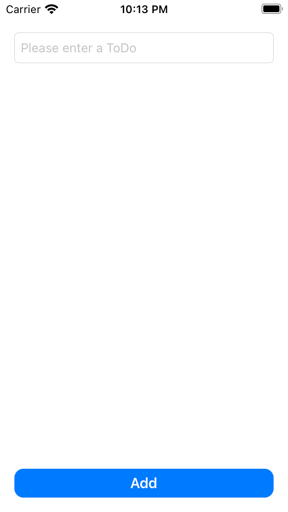
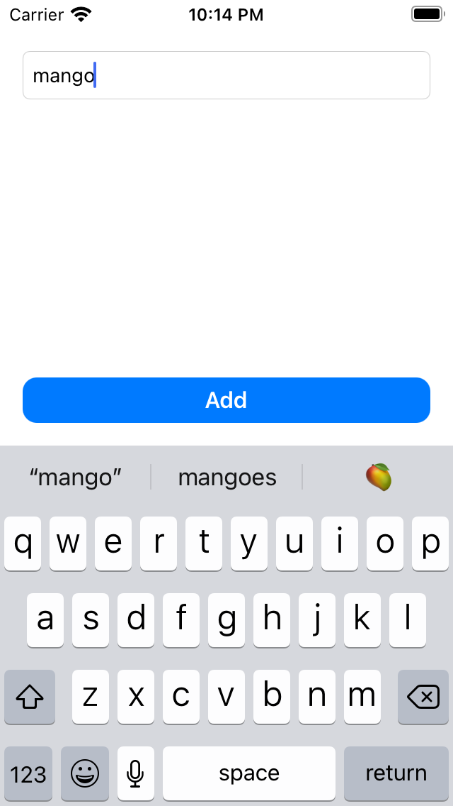
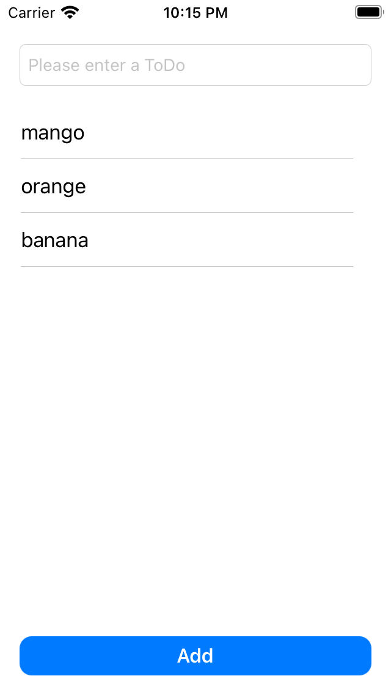

# ToDo Organizer

## About The Project
Todo organizer that takes a string and adds it to a list view

## Getting started

### Prerequisites

* iOS Deployement target >= 13.0
* Xcode version >= 12.5.1

### Installation
1. Clone the repo
2. Open the project from the .xcodeproj
3. Run the ToDoOrganizer target on an iPhone simulator

## Architecture
UI Layer is using the MVVM pattern. Navigation is implemented with the Coordinator pattern. I tried to keep the project as modular as possible to be able to easily unit tests. 

## Screenshots
* Empty state: 
* Typing a todo: 
* Multiple items: 

## Acknowledgment
The following files where copy-pasted in the project:
- CoordinatorProtocol
- Storyboarded
